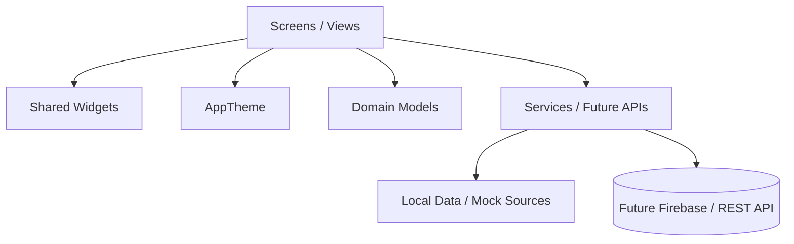

# LeadFlow CRM — Architecture & Technical Design

## 1. Executive Overview

**LeadFlow CRM** (`eligible_project`) is a cross-platform mobile Customer Relationship Management (CRM) application built using **Flutter** and **Dart**. The application enables sales representatives and business administrators to capture leads, track sales pipelines, schedule follow-ups, monitor ad campaigns (Meta / Google), manage tasks, and oversee team assignments.

---

## 2. Technology Stack & Environment

| Component | Specification | Description |
|---|---|---|
| **Framework** | Flutter (SDK `^3.13.4`) | Multiplatform UI toolkit |
| **Language** | Dart 3 | Sound null safety enabled |
| **Design System** | Material Design 3 | Custom theme (`AppTheme`) with modern typography & clean shadows |
| **Icons** | `cupertino_icons: ^1.0.8` & `Icons.*` | Material & Cupertino iconography |
| **Linting** | `flutter_lints: ^6.0.0` | Recommended Flutter & Dart code quality rules |
| **Target Platforms** | Android, iOS, Web, macOS, Windows, Linux | Cross-platform codebase |

---

## 3. Directory & File Structure

```
eligible_project/
├── android/               # Native Android host configuration
├── ios/                   # Native iOS host configuration
├── web/                   # Web platform support
├── windows/, macos/, linux/
├── test/
│   └── widget_test.dart   # Default widget test
├── pubspec.yaml           # Dependencies and asset definitions
├── README.md
├── architecture.md        # [This document] System architecture & patterns
├── routes.md              # Complete navigation & routing map
├── memory.md              # Compact token-saving context & schema memory
└── lib/
    ├── main.dart          # Application entry point (`LeadFlowCRM`)
    │
    ├── models/            # Domain entities and data structures
    │   └── lead.dart      # Lead, Activity, FollowUp classes & LeadStatus enum
    │
    ├── data/              # Mock databases & seed data
    │   └── mock_leads.dart # MockLeads.all list (independent seed dataset)
    │
    ├── services/          # Business logic and external communication
    │   └── auth_service.dart # AuthService (mock delay, login/logout interface)
    │
    ├── theme/             # Design tokens and visual styling
    │   └── app_theme.dart # AppTheme (colors, lightTheme definition, inputs, buttons)
    │
    ├── widgets/           # Shared, reusable UI components
    │   ├── app_bottom_navigation.dart # 5-tab bottom navigation bar
    │   ├── stat_card.dart             # Metric card (count, percentage change, icon)
    │   ├── lead_card.dart             # Lead summary card with navigation hook
    │   └── app_drawer.dart            # DashboardSidebar (legacy prototype drawer)
    │
    └── screens/           # Full-page views
        ├── login_screen.dart          # Authentication screen with form validation
        ├── dashboard_screen.dart      # Main hub (holds tabs 0-4 and internal demo leads)
        ├── lead_screen.dart           # Leads list, live search, status chips
        ├── lead_detail.dart           # Full lead view, status updater, notes, actions
        ├── followups_screen.dart      # Daily schedule, overdue indicators, add dialog
        ├── analytics_screen.dart      # KPI cards, funnel pipeline, conversion charts
        ├── campaigns_screen.dart      # Marketing campaign list & performance stats
        ├── tasks_screen.dart          # Task management (All/Pending/Completed) & FAB
        ├── team_screen.dart           # Member listing, roles, delete & invite actions
        ├── more_screen.dart           # Settings, integrations menu, logout trigger
        ├── add_lead_screen.dart       # [Stub: 0 Bytes] Placeholder for lead creation
        ├── notifications_screen.dart  # [Stub: 0 Bytes] Placeholder for alerts
        ├── profile_screen.dart        # [Stub: 0 Bytes] Placeholder for user profile
        └── integrations_screen.dart   # [Stub: 0 Bytes] Placeholder for integrations
```

---

## 4. Layered Architecture



### 4.1. Presentation Layer (`lib/screens/`, `lib/widgets/`)
- **State Management**: Built on Flutter's ephemeral state model using `StatefulWidget` and `setState`.
- **Top-Level Orchestration**: `DashboardScreen` maintains the active navigation tab (`currentIndex`) and passes data down to children (`leads` to `LeadsScreen`, etc.).
- **Shared Widgets**:
  - `StatCard`: Standardized KPI card with responsive sizing.
  - `LeadCard`: Displays lead name, company/source badge, contact info, and taps through to `LeadDetailsScreen`.
  - `AppBottomNavigation`: Material 3 `NavigationBar` with 5 destinations.

### 4.2. Domain Layer (`lib/models/`)
- `LeadStatus` enum: `newLead`, `contacted`, `qualified`, `converted`, `lost`.
- `Lead`: Core entity containing personal details, marketing source, campaign, status, timestamps, notes, and activity logs.
- `Activity`: Audit trail entry for actions taken on a lead.
- `FollowUp`: Scheduled task or reminder attached to a lead.

### 4.3. Service Layer (`lib/services/`)
- `AuthService`: Abstraction layer for authentication. Provides `login()` and `logout()`. Currently simulates network latency (`800ms`) and basic string validation. Ready to be backed by Firebase Auth, Supabase, or custom REST APIs.

### 4.4. Theme Layer (`lib/theme/`)
- Centralized palette:
  - `primary`: `#2563EB` (Tailwind Blue 600)
  - `primaryDark`: `#1D4ED8`
  - `background`: `#F8FAFC` (Slate 50)
  - `surface`: `#FFFFFF`
  - `textPrimary`: `#0F172A` (Slate 900)
  - `textSecondary`: `#64748B` (Slate 500)
  - `border`: `#E2E8F0` (Slate 200)

---

## 5. Architectural Inconsistencies & Technical Debt

When modifying or expanding the codebase, take note of the following findings:

1. **Dual Mock Lead Repositories**:
   - `lib/data/mock_leads.dart` defines `MockLeads.all` (6 leads).
   - `lib/screens/dashboard_screen.dart` defines a separate top-level `_demoLeads` list (5 leads).
   - *Recommendation*: Unify all mock data under `lib/data/mock_leads.dart` or a repository provider.
2. **Four Empty Screen Stubs (0 Bytes)**:
   - `add_lead_screen.dart`
   - `notifications_screen.dart`
   - `profile_screen.dart`
   - `integrations_screen.dart`
   - *Recommendation*: These are planned features; ensure any navigation to them is either stubbed with a dialog or implemented properly.
3. **Legacy Prototype Drawer (`lib/widgets/app_drawer.dart`)**:
   - Contains a `DashboardSidebar` component with pharmacy/medical terminology ("Medicines", "Inventory", "Sales", "New Medico").
   - It is **not** imported or used anywhere in the current CRM screens.
   - *Recommendation*: Refactor into a desktop/tablet responsive drawer matching LeadFlow CRM or safely remove.
4. **Auth Flow Decoupling**:
   - `LoginScreen` currently implements an inline `Future.delayed(800ms)` login instead of calling `AuthService.login()`.
   - *Recommendation*: Inject and call `AuthService().login(...)` in `LoginScreen`.

---

## 6. Target Production Architecture (Roadmap)

```
[UI Screen] 
    ↓ (User Event)
[State Notifier / Controller (Riverpod / Bloc / Provider)]
    ↓ (Repository Call)
[LeadRepository / AuthRepository]
    ↓ (HTTP / WebSocket)
[REST API / Firebase / Webhook Provider]
```

- **State Management**: Migrate from prop-drilling in `dashboard_screen.dart` to `flutter_riverpod` or `provider` for unified state across tabs.
- **Routing**: Migrate from manual `MaterialPageRoute` calls to `go_router` to support deep linking and web URL synchronization.
- **Persistence**: Integrate `shared_preferences` or `hive_ce` for offline persistence and remember-me tokens.
